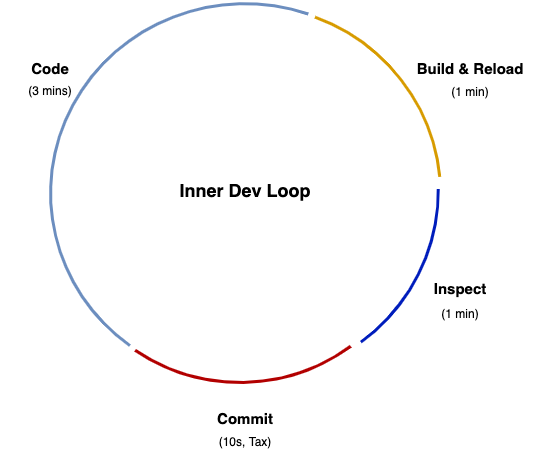
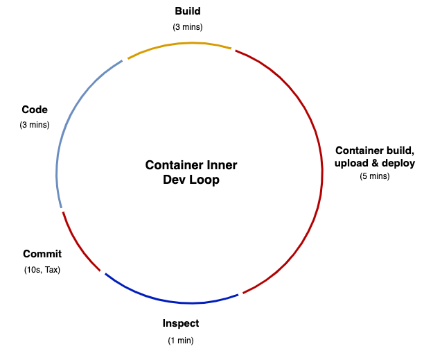
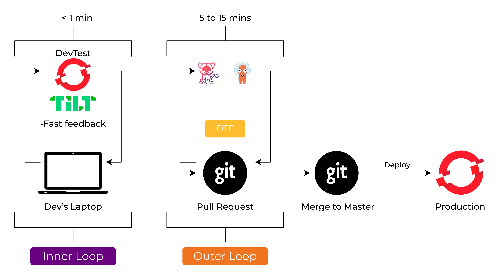
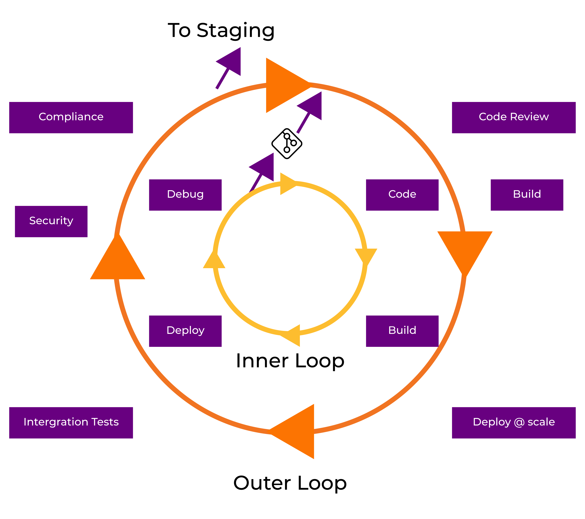

# Inner Loop and Outer Loop

## What is inner loop?

The inner dev loop is the single developer workflow. A single developer should be able to set up and use an inner dev loop to code and test changes quickly.

Even within the Kubernetes space, developers will find much of the inner dev loop familiar. That is, code can still be written locally at a level that a developer controls and committed to version control.

In a traditional inner dev loop, if a typical developer codes for 360 minutes (6 hours) a day, with a traditional local iterative development loop of 5 minutes — 3 coding, 1 building, i.e. compiling/deploying/reloading, 1 testing inspecting, and 10-20 seconds for committing code — they can expect to make ~70 iterations of their code per day. Any one of these iterations could be a release candidate. The only “developer tax” being paid here is for the commit process, which is negligible.

*In search of lost time: How does containerization change the inner dev loop?*

The inner dev loop is where writing and testing code happens, and time is critical for maximum developer productivity and getting features in front of end users. The faster the feedback loop, the faster developers can refactor and test again.

Changes to the inner dev loop process, i.e., containerization, threaten to slow this development workflow down. Coding stays the same in the new inner dev loop, but code has to be containerized. The containerized inner dev loop requires a number of new steps:

- packaging code in containers
- writing a manifest to specify how Kubernetes should run the application (e.g., YAML-based configuration information, such as how much memory should be given to a container)
- pushing the container to the registry
- deploying containers in Kubernetes

Each new step within the container inner dev loop adds to overall development time, and developers are repeating this process frequently. If the build time is incremented to 5 minutes — not atypical with a standard container build, registry upload, and deploy — then the number of possible development iterations per day drops to ~40. At the extreme that's a 40% decrease in potential new features being released. This new container build step is a hidden tax, which is quite expensive.

## Deploying from the inner loop

You might think that your job stops at local testing and a Git pull request (or a `git push`)—but that's not usually the case. You will still need to ensure that your code functions correctly in containers, runs in the cluster, and plays nicely with other containerized components. Therefore, you will want some iterations of your inner loop to deploy and debug directly into the Kubernetes cluster.

Here's a list of steps you might typically follow to deploy from the inner loop:

1. Create a dedicated namespace in the cluster for the developer.
1. Grant developer access to the namespace.
1. Describe how to configure the OS for your container: Write a Dockerfile to set up Linux.
1. Describe how to package your app into a container image: Update the Dockerfile.
1. Create a container image: Issue the commands `docker build` and `docker tag`.
1. Upload the container image to a registry: Issue a `docker push`.
1. Write one or more Kubernetes or OpenShift resource files: Write lots of YAML.
1. Deploy your app to the cluster: Issue the command: `kubectl apply -f my_app.yaml -n <deleloper-namespace>`.
1. Deploy other services to the cluster: Issue the command: `kubectl apply -f svc*.yaml -n <deleloper-namespace>`.
1. Write the config (or set `ENV`) to allow apps to work together: Issue a `kubectl create configmap`.
1. Configure apps to work together correctly: Issue a `kubectl apply -f my_configmap.yaml -n <deleloper-namespace>`.

That's a lot of steps!

## Inner vs outer loop

The inner loop consists of local coding, building, running, and testing the application—all activities that you, as a developer, can control. The outer loop consists of the larger team processes that your code flows through on its way to the cluster: code reviews, integration tests, security and compliance, and so on. The inner loop could happen mostly on your laptop. The outer loop happens on shared servers and runs in containers, and is often automated with continuous integration/continuous delivery (CI/CD) pipelines. Usually, a code commit to source control is the transition point between the inner and outer loops.

The following figure illustrates the interplay of the inner and outer loops in a Kubernetes development process, starting with local development and finishing with containers deployed in one or more clusters.

Notice that, while you code, you are constantly iterating through various development activities: You code, build, deploy locally, and debug—and you keep going until you achieve a degree of feature completeness. At some point, you will be ready to transition from inner to outer, right? Not so quick.
