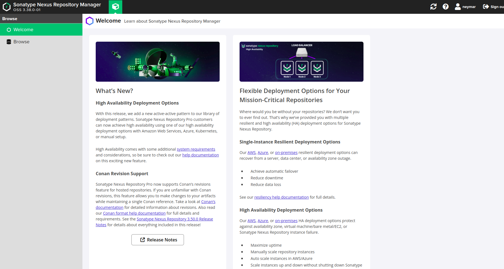
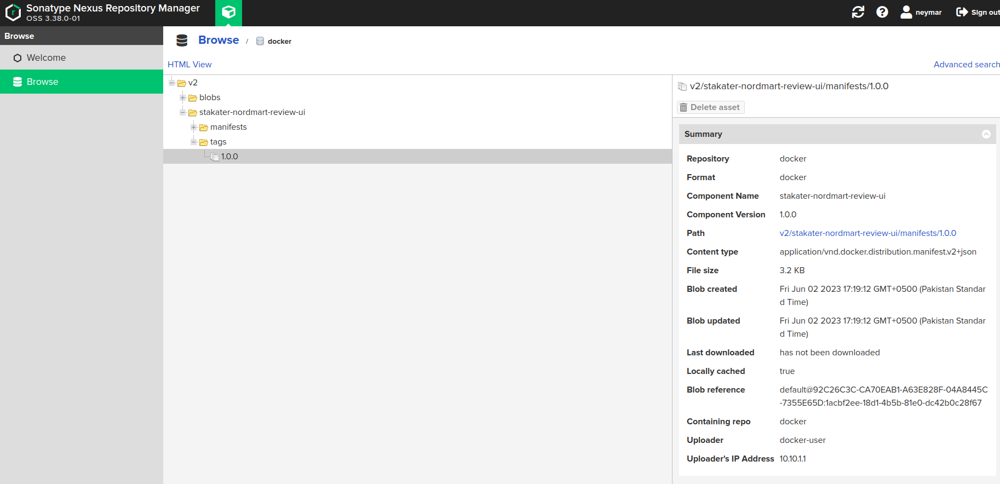

# Build and push your image to Harbor

By the end of this guide, your container image will be built and available in Harbor, ready to be referenced in a Helm chart deployment.

Replace the following placeholders with your own values throughout this guide:

| Placeholder | Description |
|---|---|
| `HARBOR_REGISTRY_URL` | The Docker registry URL from Harbor (find it via Forecastle) |
| `APP_NAME` | Your application name |
| `TENANT_NAME` | Your tenant name |
| `IMAGE_TAG` | The image tag (e.g. `1.0.0`) |

---

## 1. Find your Harbor registry URL

Open Forecastle from your cluster and locate the Harbor tile. Copy the Harbor URL, then derive the Docker registry URL:

- Remove the `https://` prefix
- Add `-docker` after the `harbor` portion of the hostname

The result is your `HARBOR_REGISTRY_URL` (e.g. `harbor-docker-stakater-harbor.apps.clustername.example.com`).

---

## 2. Log in to the registry

```bash
buildah login HARBOR_REGISTRY_URL
```

Contact your cluster administrator if you do not have registry credentials.

---

## 3. Build the image

Run the following command from your application directory:

```bash
buildah bud --format=docker --tls-verify=false --no-cache -f ./Dockerfile \
  -t HARBOR_REGISTRY_URL/TENANT_NAME/APP_NAME:IMAGE_TAG .
```

---

## 4. Push the image

```bash
buildah push HARBOR_REGISTRY_URL/TENANT_NAME/APP_NAME:IMAGE_TAG \
  docker://HARBOR_REGISTRY_URL/TENANT_NAME/APP_NAME:IMAGE_TAG
```

---

## 5. Verify

Open the Harbor UI from Forecastle. Select your project and confirm the image is listed with the expected tag.





---

With your image in Harbor, continue to [Package and push your chart](../package-and-push-your-chart/package-and-push-your-chart.md) to make it deployable via ArgoCD.
