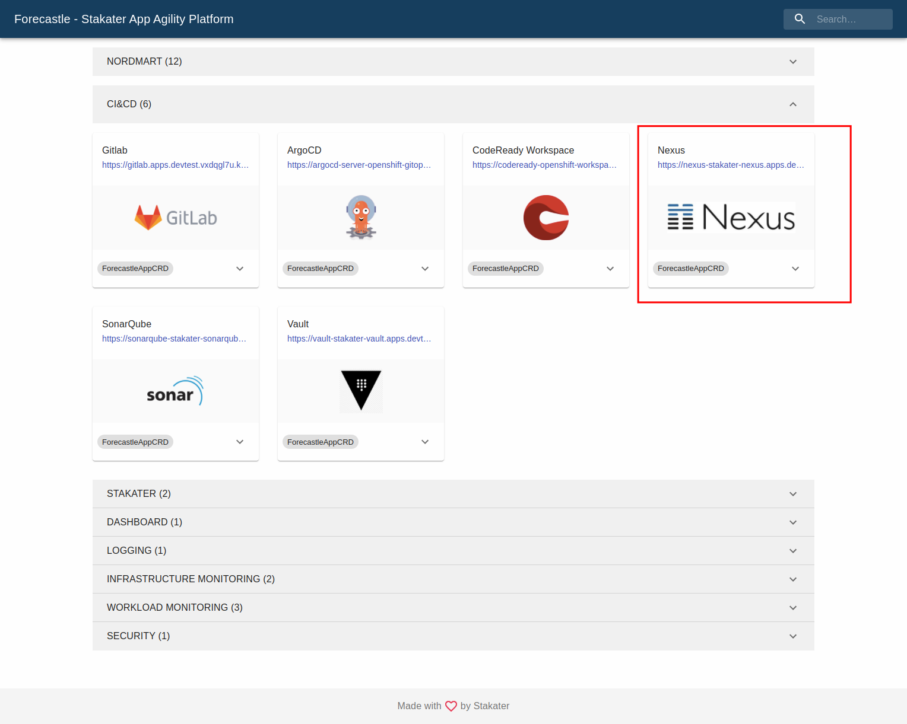
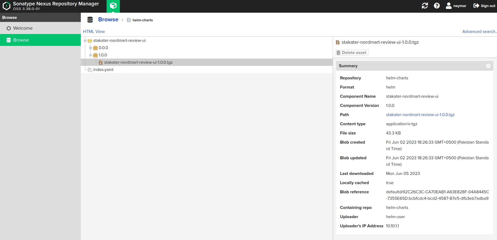

# Package and push your chart to Harbor

By the end of this guide, your Helm chart will be packaged and available in Harbor's Helm registry, ready to be deployed via ArgoCD.

Replace the following placeholders with your own values throughout this guide:

| Placeholder | Description |
|---|---|
| `HARBOR_HELM_REPO_URL` | The Helm registry URL from Harbor (find it via Forecastle) |
| `HARBOR_USERNAME` | Your Harbor username |
| `HARBOR_PASSWORD` | Your Harbor password |
| `CHART_NAME` | The name of your Helm chart |
| `CHART_VERSION` | The chart version (e.g. `1.0.0`) |

---

## 1. Find your Harbor Helm registry URL

Open Forecastle from your cluster and locate the Harbor tile. Copy the Harbor URL, then derive the Helm registry URL:

- Add `-helm` after the `harbor` portion of the hostname
- Append `/repository/helm-charts/` to the path

The result is your `HARBOR_HELM_REPO_URL` (e.g. `https://harbor-helm-stakater-harbor.apps.clustername.example.com/repository/helm-charts/`).

---

## 2. Package the chart

Run the following command from your chart directory:

```bash
helm package .
```

This creates a versioned archive file: `CHART_NAME-CHART_VERSION.tgz`.

---

## 3. Push the chart to Harbor

```bash
curl -u "HARBOR_USERNAME":"HARBOR_PASSWORD" HARBOR_HELM_REPO_URL \
  --upload-file "CHART_NAME-CHART_VERSION.tgz"
```

---

## 4. Verify

Open the Harbor UI from Forecastle. Select **Browse**, then click **Helm Charts** to confirm your chart is listed.





---

With your chart in Harbor, continue to [Deploy with ArgoCD and Helm](../deploy-app-with-argocd-and-helm/deploy-app-with-argocd-and-helm.md) to deploy it to the cluster.
