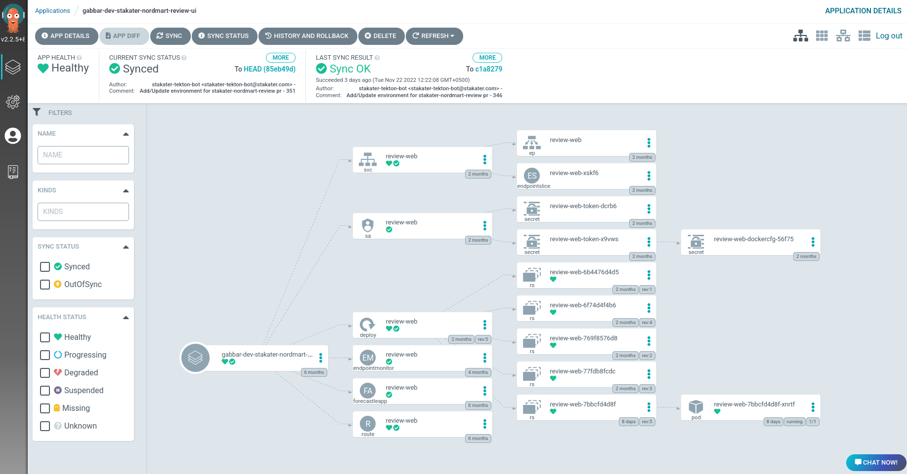
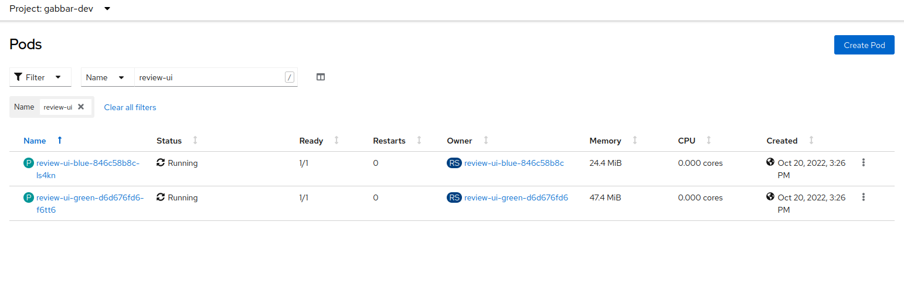
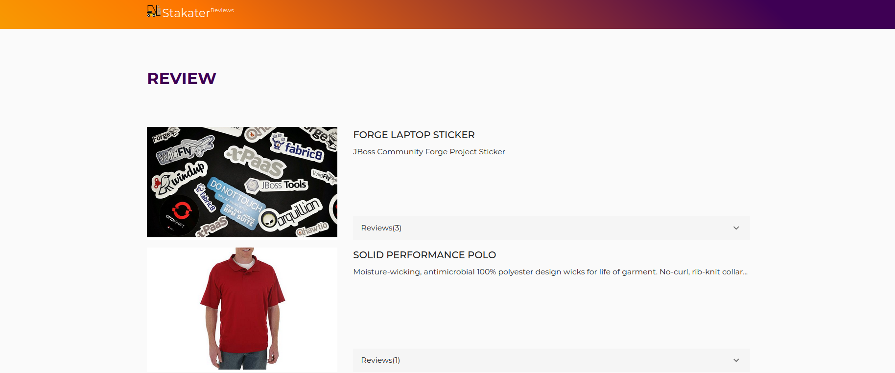

# Deploy a demo app

By the end of this tutorial, you will have built a container image, pushed it to Harbor, packaged a Helm chart, deployed it via ArgoCD, and verified the application is running in your cluster.

This tutorial uses [`stakater-nordmart-review-web`](https://github.com/stakater-lab/stakater-nordmart-review-web) as the demo application. Replace `APP_NAME` with `stakater-nordmart-review-web` as you follow along, or substitute your own application.

**Prerequisites:**

- A tenant is defined in your infra GitOps repository — see [Configure the infra GitOps repository](../../platform-setup/tutorials/configure-infra-gitops-repo.md).
- The tenant is onboarded in your apps GitOps repository — see [Configure the apps GitOps repository](../../platform-setup/tutorials/configure-apps-gitops-repo.md).
- Harbor registry is available. Contact your administrator for credentials.
- Tools installed: [`helm`](https://helm.sh/docs/intro/install/), [`git`](https://git-scm.com/downloads), [`oc`](https://docs.openshift.com/container-platform/4.11/cli_reference/openshift_cli/getting-started-cli.html), [`buildah`](https://github.com/containers/buildah/blob/main/install.md)

Replace the following placeholders with your own values throughout this tutorial:

| Placeholder | Description |
|---|---|
| `TENANT_NAME` | Your tenant name |
| `APP_NAME` | Your application name (use `stakater-nordmart-review-web` for this demo) |
| `IMAGE_TAG` | The image tag (e.g. `1.0.0`) |
| `HARBOR_REGISTRY_URL` | The Harbor Docker registry hostname (without `https://`, find it via Forecastle) |
| `HARBOR_HELM_REPO_URL` | The Harbor Helm registry URL (find it via Forecastle) |

---

## 1. Log in to the Harbor registry

Find the Harbor URL in Forecastle, then log in:

```bash
buildah login HARBOR_REGISTRY_URL
```

---

## 2. Add a Dockerfile

Your application repository needs a `Dockerfile` at the root. Clone the demo app to follow along:

```bash
git clone https://github.com/stakater-lab/stakater-nordmart-review-web
cd stakater-nordmart-review-web
```

The demo app already includes a Dockerfile. For your own application, create one based on a suitable base image from the [Red Hat container catalog](https://catalog.redhat.com/software/containers/search). Below is the demo app's Dockerfile as a reference:

```Dockerfile
FROM node:14 as builder
LABEL name="Nordmart review"

RUN mkdir -p $HOME/application
WORKDIR $HOME/application

COPY . .

RUN npm ci
ARG VERSION
RUN npm run build -- --env VERSION=$VERSION

EXPOSE 4200
CMD ["node", "server.js"]
```

Use [multi-stage builds](https://docs.docker.com/build/building/multi-stage/) to keep the final image small — build in one stage, copy only the output into a minimal runtime image.

---

## 3. Build and push the image

Build the image from your application directory:

```bash
buildah bud --format=docker --tls-verify=false --no-cache \
  -f ./Dockerfile \
  -t HARBOR_REGISTRY_URL/TENANT_NAME/APP_NAME:IMAGE_TAG .
```

Push it to Harbor:

```bash
buildah push HARBOR_REGISTRY_URL/TENANT_NAME/APP_NAME:IMAGE_TAG \
  docker://HARBOR_REGISTRY_URL/TENANT_NAME/APP_NAME:IMAGE_TAG
```

---

## 4. Add a Helm chart

In your application repository, create a `deploy/` folder at the root with two files.

`deploy/Chart.yaml`:

```yaml
apiVersion: v2
name: APP_NAME
description: A Helm chart for Kubernetes
dependencies:
  - name: application
    version: 2.1.13
    repository: https://stakater.github.io/stakater-charts
type: application
version: IMAGE_TAG
```

`deploy/values.yaml`:

```yaml
application:
  applicationName: APP_NAME
  deployment:
    imagePullSecrets: nexus-docker-config-forked
    image:
      repository: APP_NAME
      tag: IMAGE_TAG
  route:
    enabled: true
    port:
      targetPort: http
```

Validate the chart before committing:

```bash
cd deploy/
helm dependency build
helm template . > output.yaml
```

Open `output.yaml` to confirm the generated manifests look correct.

---

## 5. Package and push the chart to Harbor

```bash
helm package .
curl -u "HARBOR_USERNAME":"HARBOR_PASSWORD" HARBOR_HELM_REPO_URL \
  --upload-file "APP_NAME-IMAGE_TAG.tgz"
```

---

## 6. Add the application to apps-gitops-config

In your `apps-gitops-config` repository, create the deployment folder at `TENANT_NAME/APP_NAME/dev/`.

`TENANT_NAME/APP_NAME/dev/Chart.yaml`:

```yaml
apiVersion: v2
name: APP_NAME
description: A Helm chart for Kubernetes
dependencies:
  - name: APP_NAME
    version: IMAGE_TAG
    repository: HARBOR_HELM_REPO_URL
version: IMAGE_TAG
```

`TENANT_NAME/APP_NAME/dev/values.yaml`:

```yaml
APP_NAME:
  application:
    deployment:
      image:
        repository: HARBOR_REGISTRY_URL/TENANT_NAME/APP_NAME
        tag: IMAGE_TAG
```

Commit and push both files.

---

## 7. Verify in ArgoCD

Log in to ArgoCD via Forecastle. Locate the application named `TENANT_NAME-dev-APP_NAME` and confirm it has synced successfully.



Open the OpenShift console, navigate to **Workloads > Pods** in the `TENANT_NAME-dev` namespace, and confirm the pods are running.



Open the route URL to confirm the application is serving traffic.



---

With your first application deployed, continue to [Promote your application](../how-to-guides/promote-your-application/promote-your-application.md) to release it to the next environment.
