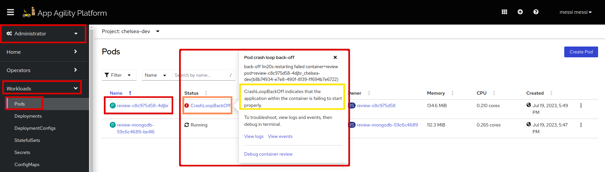
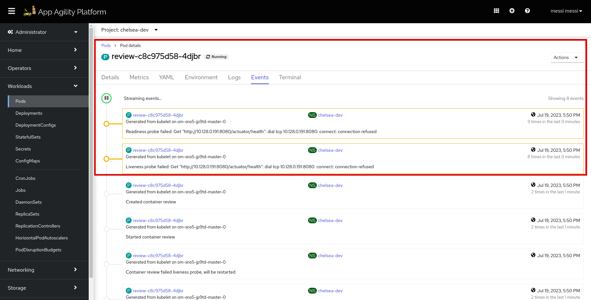
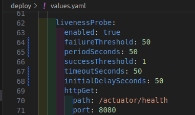
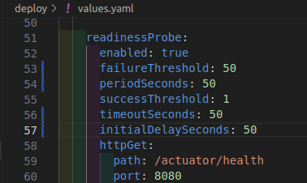
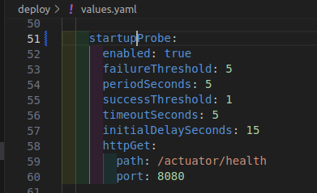
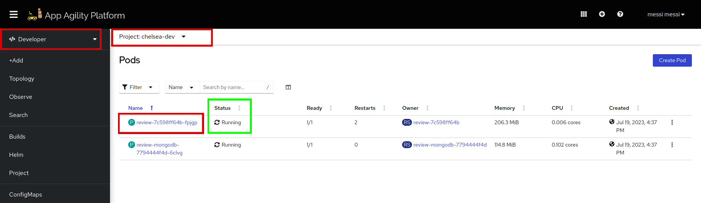
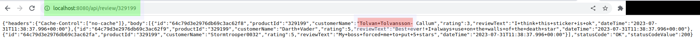
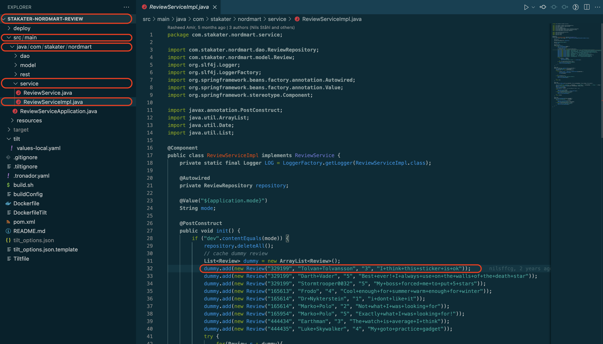
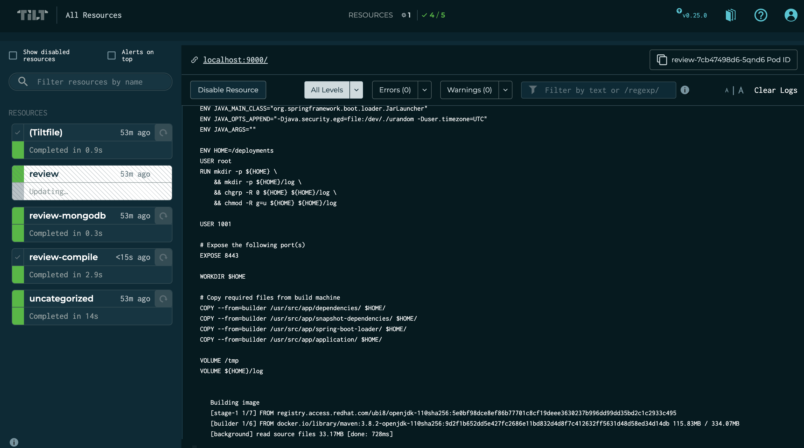
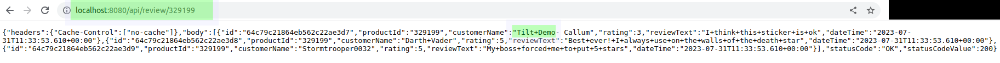

# Configure Probes for your Application

{{ product_name }} provides robust mechanisms for managing the health and availability of container applications. Liveness, readiness, and startup probes are essential features that help ensure application reliability and stability.

In this tutorial, we will explore how to leverage the capabilities of {{ product_name }} to define different probes using the `values.yaml` file.

## Objective

- Configure your application's liveness, readiness, and startup probes with their parameters.

## Key Results

- Configure probe settings to effectively monitor application health and readiness.

## Tutorial

### Probes Error

When Deploying `Stakater Nordmart Review API` application, you might see this error in your application pods.

  

  The pod status shows `CrashLoopBackOff`. Let's see pod's events for more detailed logs:

  

  Because of the liveness and readiness probes got failed, the pods are not in running state.

So, to deploy your application smoothly you need to configure probes.

1. To add a liveness probe in your application, you need to define it in your `deploy/values.yaml`. Liveness probes continuously monitor the health of containers and automatically restart any instances that fail the health check.

    ```yaml
    # Liveness Probe Configuration
    livenessProbe:
        # Enable liveness probe for the container
      enabled: true
        # Number of consecutive failures to consider the container as unhealthy
      failureThreshold: 50
        # Interval at which the liveness probe will be performed
      periodSeconds: 50
        # Number of consecutive successes required to consider the container as healthy again
      successThreshold: 1
        # Maximum time the probe can take before it is considered failed
      timeoutSeconds: 50
        # Initial delay before the first liveness probe is performed
      initialDelaySeconds: 50
        # http GET request used for the liveness probe
      httpGet:
        # Path for the health check endpoint
        path: /actuator/health
        # Port number where the health check endpoint is exposed
        port: 8080
    ```

    !!! note
        Indentation should be followed as: **application.deployment.livenessProbe**.

    It should look like this:

    

    !!! note
        You can configure the parameters of the probe per your application's requirement. To know more about liveness probes, visit [here](https://kubernetes.io/docs/tasks/configure-pod-container/configure-liveness-readiness-startup-probes/).

1. To add a readiness probe in your application, you need to define it in your `deploy/values.yaml`. Readiness probes determine if a container is ready to serve traffic and delay routing until the container is ready.

    ```yaml
    # Readiness Probe Configuration
    readinessProbe:
        # Enable readiness probe for the container
      enabled: true
        # Number of consecutive failures to consider the container as not ready
      failureThreshold: 50
        # Interval at which the readiness probe will be performed
      periodSeconds: 50
        # Number of consecutive successes required to consider the container as ready
      successThreshold: 1
        # Maximum time the probe can take before it is considered failed
      timeoutSeconds: 50
        # Initial delay before the first readiness probe is performed
      initialDelaySeconds: 50
        # http GET request used for the readiness probe
      httpGet:
        # Path for the health check endpoint
        path: /actuator/health
        # Port number where the health check endpoint is exposed
        port: 8080
    ```

    !!! note
        Indentation should be followed as: **application.deployment.readinessProbe**.

    It should look like this:

    

    !!! note
        You can configure the parameters of the probe as per your application's requirement. To know more about readiness probes, visit [here](https://kubernetes.io/docs/tasks/configure-pod-container/configure-liveness-readiness-startup-probes/).

1. To add startup probe in your application, you need to define it in your `deploy/values.yaml`. Startup probe is specifically designed to check if an application has completed its initialization and is fully ready to serve traffic.

    ```yaml
    # Startup Probe Configuration
    startupProbe:
        # Enable the startup probe for the container
      enabled: true
        # Number of consecutive failures to consider the startup as unsuccessful
      failureThreshold: 5
        # Interval at which the startup probe will be performed
      periodSeconds: 5
        # Number of consecutive successes required to consider the startup as successful
      successThreshold: 1
        # Timeout for the startup probe
      timeoutSeconds: 5
        # Delay before the first startup probe is performed
      initialDelaySeconds: 5
        # http GET request used for the startup probe
      httpGet:
        # Path for the startup check endpoint
        path: /actuator/health
        # Port number where the startup check endpoint is exposed
        port: 8080
    ```

    !!! note
        Indentation should be followed as: **application.deployment.startupProbe**.

    It should look like this:

    

    !!! note
        You can configure the parameters of the probe as per your application's requirement. To know more about startup probes, visit [here](https://kubernetes.io/docs/tasks/configure-pod-container/configure-liveness-readiness-startup-probes/).

1. Save the `values.yaml` and run `tilt up` at the root of your directory. Press the space key to view the progress in Tilt web UI. The application should be running in the namespace used in `tilt_options.json` file.

    

1. In your Tiltfile, there is a port forwarding command written on line #60, this command will forward the port of the application to your local machine. To see the output of the deployment:

    ```sh
    curl localhost:8080/api/review/329199
    ```

    

    Review the JSON output on browser:

    

1. let's make one change; we will update the first review text to "Tilt Demo"

    

    Switch back to the tilt browser, you will see it has started picking up changes

    

    Within a few seconds, the change will be deployed, and you can refresh the route to see the change

    

    Awesome! you made it

1. Run `tilt down` to delete the application and related configuration from the namespace.

Good Job! Let's move on to next tutorial, where we'll see how we can persist data of our application.
