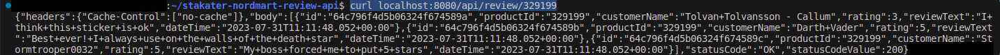

# Containerize the Application

Running workloads in Kubernetes/OpenShift requires the application to be containerized. Typically, this includes taking a relevant base image, installing application dependencies if not available, copying & building the code and command to run your application executed at runtime.

## Objectives

- Containerize your application for deployment on {{ product_name }}.

## Key Results

- Dockerfile created.
- Image built and pushed to image repository

## Tutorials

Consider the [`stakater-nordmart-review-api`](https://github.com/stakater-lab/stakater-nordmart-review-api) application.

```sh
git clone https://github.com/stakater-lab/stakater-nordmart-review-api
cd stakter-nordmart-review-api
```

Lets create a Dockerfile inside the repository folder and delete any existing file.

  1. Decide a base image for your application. Navigate to [RedHat Container Registry](https://catalog.redhat.com/software/containers/search) and Find a suitable image for your application. Since this application is java application. We use `maven` base image.

      ```Dockerfile
      FROM maven:3.8.6-openjdk-11-slim AS build
      ```

  1. Use COPY and RUN commands to copy required content to containers filesystem and run commands in containers context.

      ```Dockerfile
      COPY src /usr/src/app/src
      COPY pom.xml /usr/src/app
      RUN mvn -f /usr/src/app/pom.xml clean package
      ```

  1. We will use another FROM statement to create a multi-stage build for reducing the overall image size. More info [here](https://docs.docker.com/build/building/multi-stage/). With multi-stage builds, you use multiple FROM statements in your Dockerfile. Each FROM instruction can use a different base, and each of them begins a new stage of the build. You can selectively copy artifacts from one stage to another, leaving behind everything you don't want in the final image.

      ```Dockerfile
      FROM registry.access.redhat.com/ubi8/openjdk-11:1.14-10
      ```

  1. Add labels to your image, if any.

      ```Dockerfile
      LABEL name="inventory" \
      maintainer="Stakater <hello@stakater. com>" \
      vendor="Stakater" \
      release="1" \
      summary="Java Spring boot application"
      ```

  1. Set an environment variable with `ENV` command and set it as working directory.

      ```Dockerfile
      ENV HOME=/opt/app
      WORKDIR $HOME
      ```

  1. Use EXPOSE command to expose a container port, typically this corresponds to port on which application runs.

      ```Dockerfile
      EXPOSE 8080
      ```

  1. JAR files were generated as a result of `mvn package`. Copy the artifact generated from build stage.

      ```Dockerfile
      COPY --from=build /usr/src/app/target/*.jar $HOME/artifacts/app.jar
      ```

  1. Define user.

      ```Dockerfile
      USER 1001
      ```

  1. Set the Entrypoint

      ```Dockerfile
      ENTRYPOINT exec java $JAVA_OPTS -jar artifacts/app.jar
      ```

  1. Finally, specify the command to be executed when container is created with this image, typically the command to run the application.

      ```Dockerfile
      CMD ["java", "-jar", "artifacts/app.jar"]
      ```

  1. Run the following command to build the image.

      ```sh
      docker build -t <app-name>:1.0.0 .
      ```

  1. Execute the following command to run the image.

    !!! note
        To run the application container you need Mongo_DB server running.

      ```sh
      # -p flag exposes container port 8080 on your local port 8080
      # --env flag allows Mongo_DB necessary environment variables; e.g. MONGO_HOST, MONGO_DB_PASS
      docker run -dt -p [<localhost-port>:<container-port>] --env <variable1>=<value> --env <variable2>=<value> <image-name>:1.0.0
      ```

    !!! note
        If Mongo_DB server is running on your local machine, replace **-p** flag and it's values with --network="host".

      ```sh
      docker run -dt --network="host" --env <variable1>=<value> --env <variable2>=<value> <image-name>:1.0.0
      ```

  1. Run a curl command to verify that image is running.

      ```sh
      curl localhost:8080/api/review/329199
      ```

      

Read the following articles for more information:

- [Containerize an application](https://docs.docker.com/get-started/02_our_app/)
- [Tutorial: Containerize a .NET app](https://learn.microsoft.com/en-us/dotnet/core/docker/build-container?tabs=linux)
- [Containerize Your Application With Docker](https://towardsdatascience.com/containerize-your-application-with-docker-b0608557441f)
- [`Dockerizing a Node.js web app`](https://nodejs.org/en/docs/guides/nodejs-docker-webapp)
- [`Dockerizing a Django app`](https://blog.logrocket.com/dockerizing-django-app)
