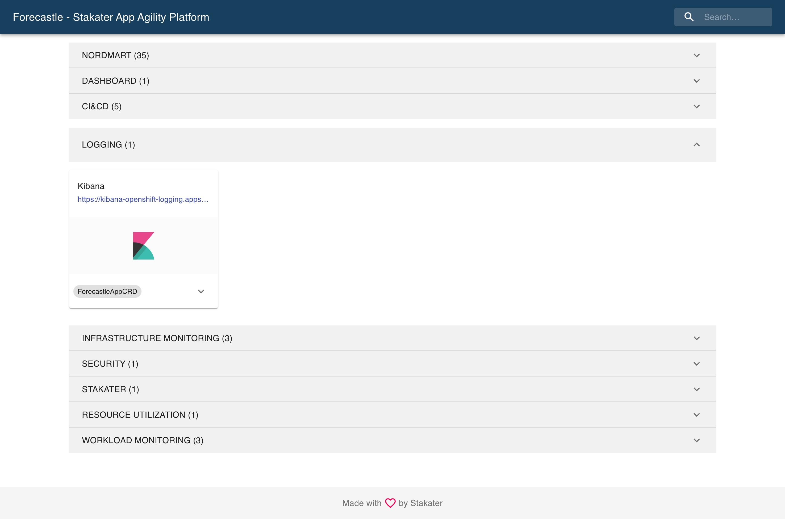
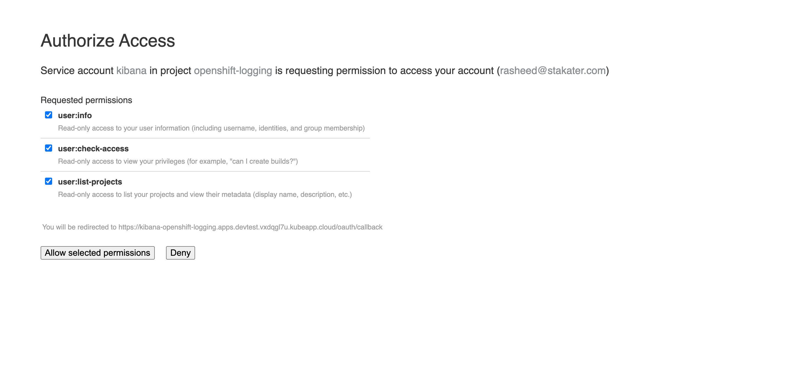
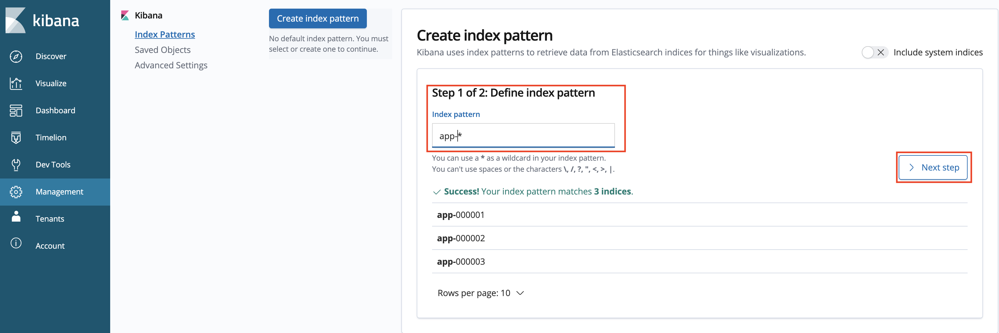
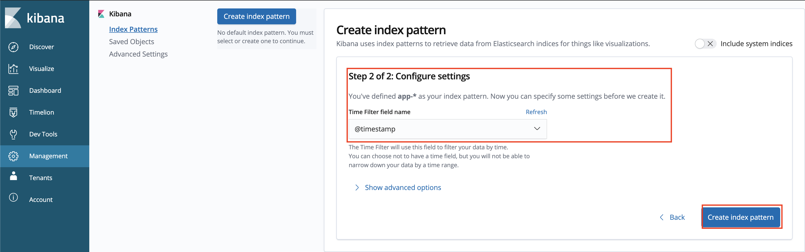
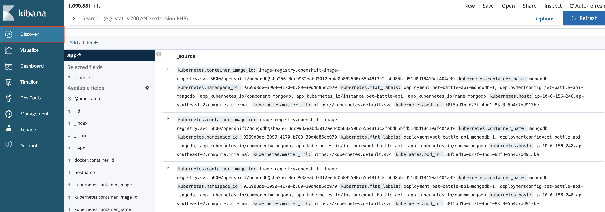
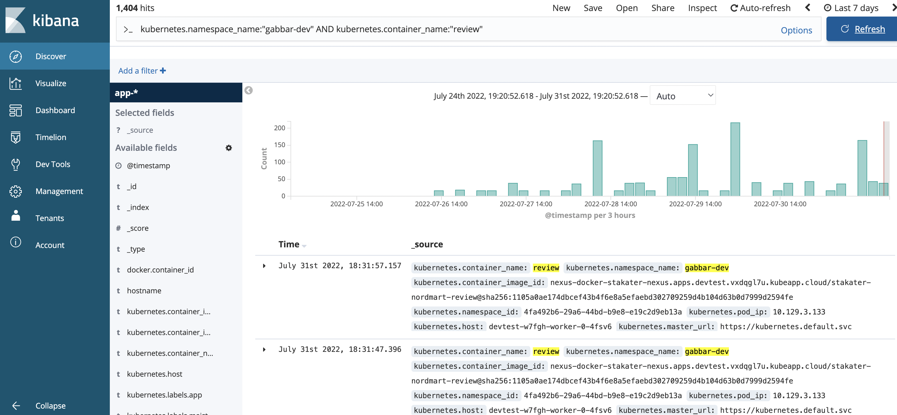
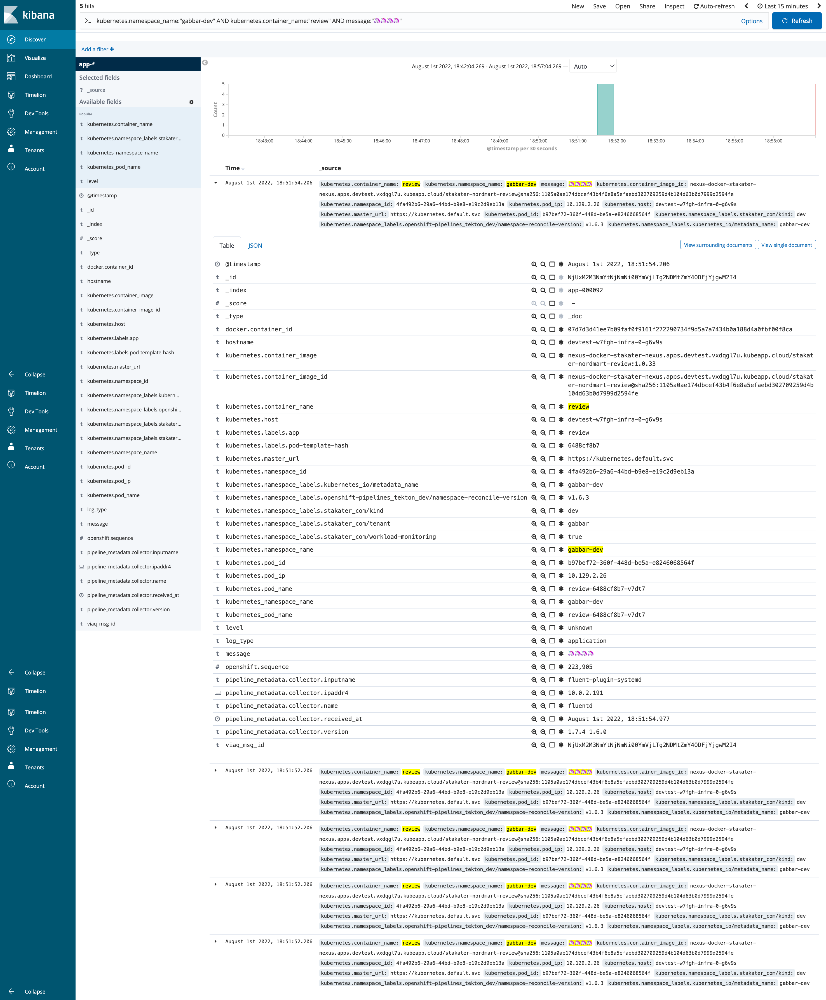

# Enable logging for your Application

Logging is an essential aspect of any application deployment, providing valuable insights into its behavior and performance. In {{ product_name }}, logging is enabled by default for all applications, ensuring that you have access to vital log data right from the start.

## Objectives

- Enable efficient querying and visualization of logs from multiple services and provide a user-friendly interface to access and analyze logs in real-time using Kibana.

- Ensure that application logs are stored securely and comply with legal obligations using Fluentd, Elastic Search.

- Facilitate easier debugging and error analysis through log aggregation and filtering using Kibana, Fluentd, and Elastic Search.

## Key Results

- Improve log storage and retrieval capabilities, while centralizing log collection and aggregation, to enhance troubleshooting and monitoring within {{ product_name }}.

## Tutorial

### Aggregated Logging

1. Observe logs from any given container:

    ```bash
    oc project <your-namespace>
    oc logs `oc get po -l app.kubernetes.io/component=mongodb -o name -n <your-namespace>` --since 10m
    ```

    By default, these logs are not stored in a database, but there are a number of reasons to store them (i.e. troubleshooting, legal obligations..)

    {{ product_name }} comes equipped with a powerful logging mechanism that collects logs from various services. Any data written to `STDOUT` or `STDERR` is automatically collected by Fluentd and indexed in Elastic Search. This efficient setup makes indexing and querying logs a breeze. Kibana is added on top for easy visualization of the data.

1. Let's take a look at Kibana now. Back to Forecastle:

    

1. Login using your standard credentials. On the first login, you'll need to `Allow selected permissions` for OpenShift to pull your permissions.

    

    Once logged in, you'll be prompted to create an `index` to search on. This is because there are many data sets in elastic search, so you must choose the ones you would like to search on. We'll just search on the application logs as opposed to the platform logs in this exercise.

1. Create an index pattern of `app-*` to search across all application logs in all namespaces.

    

1. On configure settings, select `@timestamp` to filter by and create the index.

    

1. Go to the Kibana Dashboard - Hit `Discover` in the top right-hand corner, we should now see all logs across all pods. It's a lot of information but we can query it easily.

    

1. Let's filter the information, and look for the logs specifically for pet-battle apps running in the test namespace by adding this to the query bar:

    ```yaml
    kubernetes.namespace_name:"<your-namespace>" AND kubernetes.container_name:"review"
    ```

    

    Container logs are ephemeral, so once they die you'd lose them unless they're aggregated and stored somewhere. Let's generate some messages and query them from the UI in Kibana.

1. Connect to the pod via `rsh` and generate logs.

    ```bash
    oc project <your-namespace>
    oc rsh `oc get po -l app.kubernetes.io/name=review -o name -n <your-namespace>`
    ```

    Then inside the container you've just remote logged on to we'll add some nonsense messages to the logs:

    ```bash
    echo "🦄🦄🦄🦄" >> /tmp/custom.log
    tail -f /tmp/custom.log > /proc/1/fd/1 &
    echo "🦄🦄🦄🦄" >> /tmp/custom.log
    echo "🦄🦄🦄🦄" >> /tmp/custom.log
    echo "🦄🦄🦄🦄" >> /tmp/custom.log
    echo "🦄🦄🦄🦄" >> /tmp/custom.log
    exit
    ```

1. Back on Kibana we can filter and find these messages with another query:

    ```yaml
    kubernetes.namespace_name:"<your-namespace>" AND kubernetes.container_name:"review" AND message:"🦄🦄🦄🦄"
    ```

    
