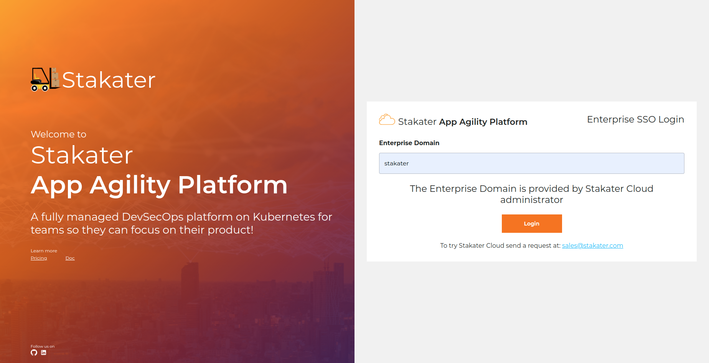
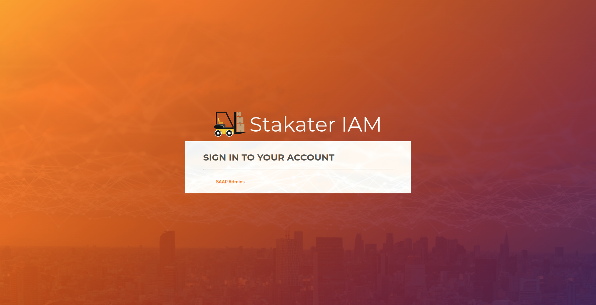
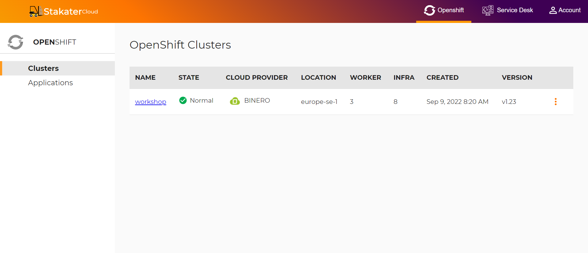
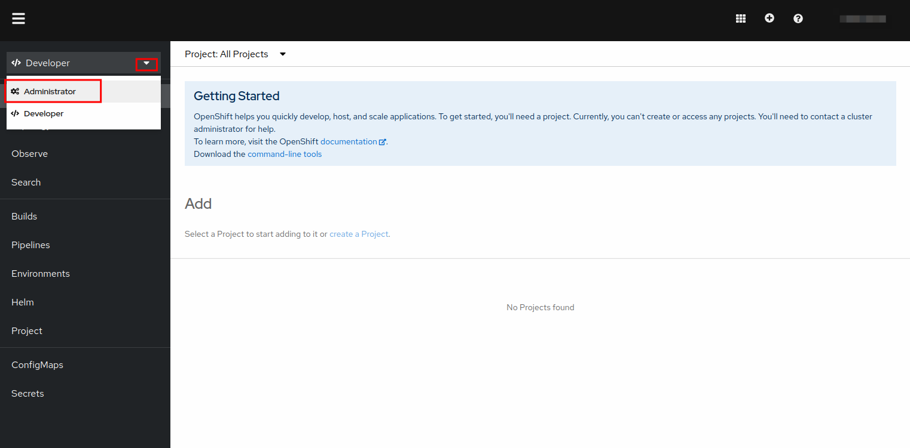
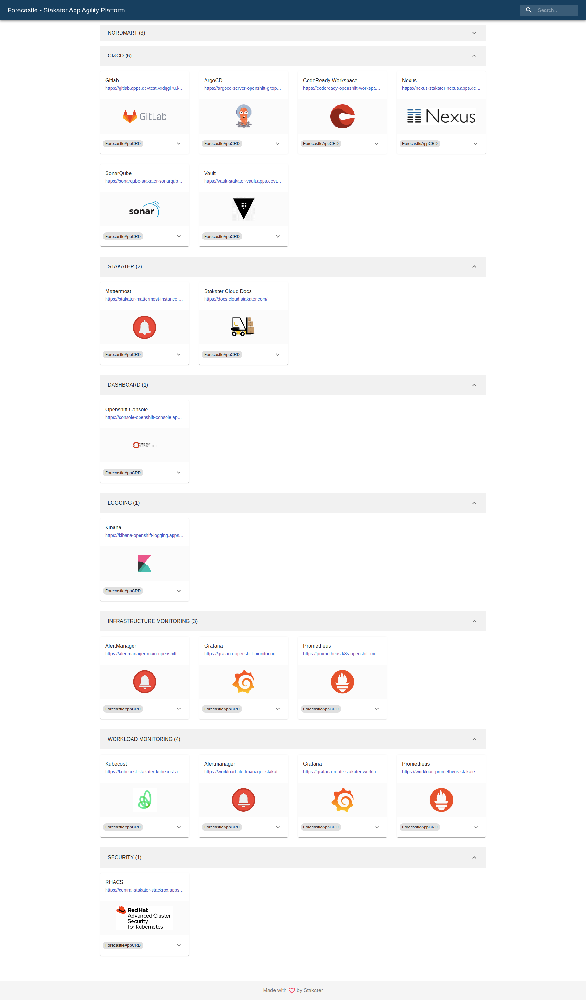
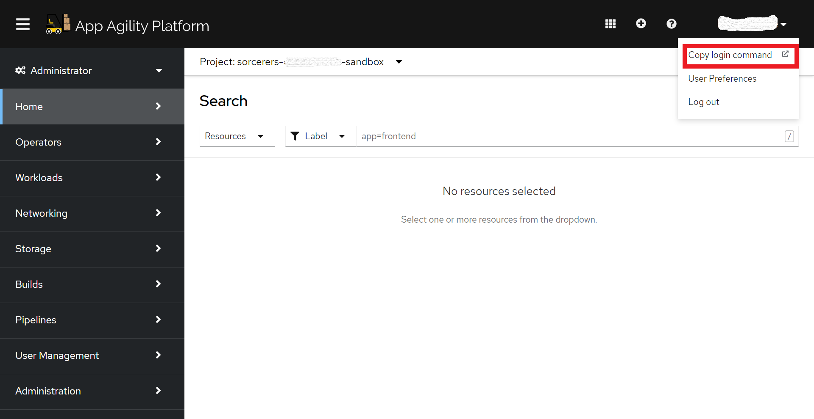
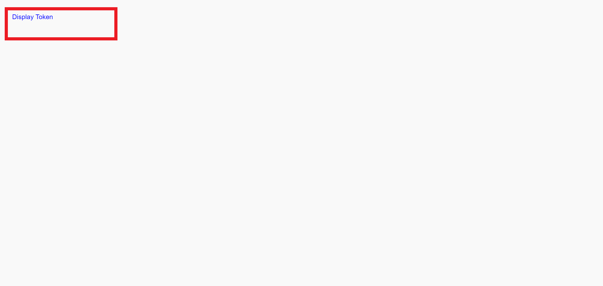
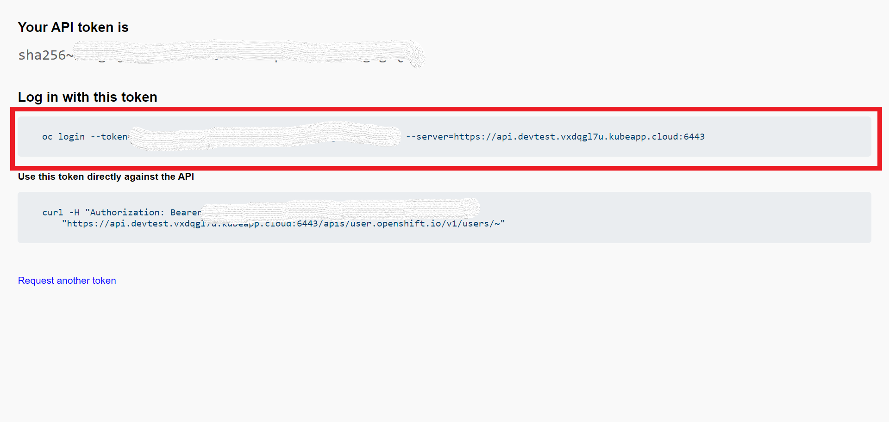

# Access your Cluster

## Objectives

Access the {{ product_name }} cluster on UI and CLI.

## Key Results

- Access {{ product_name }} Console
- View Forecastle Page and view different tools/services.

## PreRequisites

- Working laptop or desktop computer.

## Guide

### Access OpenShift UI

Lets see how will you access your cluster.

1. Access your cluster by going to [{{ product_name }}](https://cloud.stakater.com/). Enter your enterprise domain provide by Stakater Cloud administrator.

    

1. Log In with the method configured for your Organization.

    

1. Once you've logged in, you ll be directed to similar cluster overview page.

    

1. Click on drop down toggle for the relevant cluster:

    1. Select `OpenShift Web Console` to open the OpenShift Web Console.

        

        > You should belong to a Tenant

    1. Select Forecastle for view services available on the cluster.

        

### Login with CLI

1. In your `OpenShift Console`, click your username in the top right corner and select `Copy login command`.
    

1. Click on `Display token` to view your token and login command.

    

1. Copy your Log in command.

    

1. Run the following command from your CLI.

    ```bash
    oc login --token=<TOKEN> --server=<SERVER>
    ```
