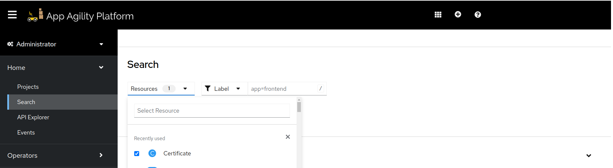

# Configuring Cert Manager Certificate and External DNS

This document provides a step-by-step guide to configure Cert Manager Certificate and External DNS for different tenants.

## Step 1: Setup DNS creds in OpenBao

Go to `common-shared-secret` path in OpenBao and create a secret `external-dns-creds`. This secret mainly have credentials for authenticating with DNS provider and should contain following fields:

### Cloudflare

| Key | Required/Optional | Explanation |
|----------|----------|----------|
| `api-token`   | required   | API token generated from DNS provider being used. In case of Cloudflare, it should have the following access <br> - `DNS:Edit` <br> - `Zone:Read` |
| `domain-filter`    | optional   | This field should contain base domain that becomes base for registering further subdomains. For example: `example.com`. |
| `zone-id-filter`| optional   | In case of Cloudflare, if you want to give more restrictive access of only few zones to this token, then this field should contain these zone ids. |

!!! note

Before proceeding further, confirm with Cluster Administrator that ClusterIssuer is setup in cluster as next steps are dependent on this resource.

## Step 2: Create Certificate Resource

Next step is to deploy Certificate. For that we need to deploy following resources at given paths in Infra GitOps.

### ArgoCD application

  `Path: <cluster>/argocd-apps/`

  ```yaml
  apiVersion: argoproj.io/v1alpha1
  kind: Application
  metadata:
    name: <resource name. E.g. certificate-config>
    namespace: rh-openshift-gitops-instance
  spec:
    destination:
      namespace: <tenant's system namespace>
      server: https://kubernetes.default.svc
    project: <project name>
    source:
      path: <cluster>/<path where Certificate resource exist in Infra GitOps repo>
      repoURL: <infra Gitops repo URL>
      targetRevision: HEAD
    syncPolicy:
      automated:
        prune: true
        selfHeal: true
  ```

#### Key Fields

- **`.spec.destination.namespace`**: Namespace where you want to deploy certificates. Usually it is `system` namespace that is assigned to your tenant. Check with cluster admin for availability of this namespace.
- **`.spec.project`**: Project name that this application should belong to. This can be a name of tenant.
- **`.spec.source.path`**: Path in Infra GitOps repo that this application should sync. This corresponds to the path of folder where `Certificate` resource would exist.
- **`.spec.source.repoURL`**: This is the URL of Infra GitOps repo.

### Certificate

  `Path: <cluster>/<path where Certificate resource exist in Infra Gitops repo>`

  ```yaml
  apiVersion: cert-manager.io/v1
  kind: Certificate
  metadata:
    name: certificate
  spec:
    secretName: <secret name which will host TLS certificate>
    duration: 8760h0m0s
    renewBefore: 720h0m0s
    subject:
      null
    commonName: null
    usages:
      null
    dnsNames:
      - '*.example.com'
    issuerRef:
      name: <cluster issuer name>
      kind: ClusterIssuer
      group: cert-manager.io
  ```

#### Key Fields

- **`.spec.secretName`**: Name of the secret that cert-manager will create once the certificate request gets approved by Certificate Authority (in present case LetsEncrypt).
- **`.spec.dnsNames`**: List of DNS names that you want this certificate to support. This list can also include [wild card domain names](https://knowledge.digicert.com/general-information/what-is-a-wildcard-certificate) like `*.example.com`.
- **`.spec.issuerRef.name`**: Name of the cluster issuer that you want to use when creating this certificate. You can confirm value for this field with cluster admin.

Commit, push, and merge these changes to the `main` branch. ArgoCD will deploy the resources to the specified namespaces within few minutes. Confirm that certificate is available in system namespace and is up-to-date before proceeding further.

## Step 3: Distribute certificate across tenant namespaces

The next step is to distribute the TLS certificate across namespaces for use. Create following resources in your Infra GitOps repository at given path:

```plaintext
<cluster>/tenant-operator-config/templates/
```

- [`Template`](https://docs.stakater.com/mto/main/crds-api-reference/template.html)
- [`TemplateGroupInstance`](https://docs.stakater.com/mto/main/crds-api-reference/template-group-instance.html)

### Template

The `Template` resource defines a way to distribute a secret resource across namespaces. Use the following template for setting up a secret containing TLS certificate:

```yaml
apiVersion: tenantoperator.stakater.com/v1alpha1
kind: Template
metadata:
  name: certificate-template
resources:
  resourceMappings:
    secrets:
      - name: <secret name containing TLS certificate in system namespace>
        namespace: <system namespace>
```

#### Key Fields

- **`.spec.secret.name`**: Secret name that certificate will create in system namespace
- **`.spec.secret.namespace`**: Namespace where certificate will create a secret. Usually this is a system namespace in current tenant.

### TemplateGroupInstance

The `TemplateGroupInstance` deploys resources by referencing the created templates and specifying target namespaces:

```yaml
apiVersion: tenantoperator.stakater.com/v1alpha1
kind: TemplateGroupInstance
metadata:
  name: certificate-creds
spec:
  template: certificate-template
  selector:
    matchExpressions:
      - key: stakater.com/tenant
        operator: In
        values: [ <comma separated tenant names list> ]
  sync: true
```

#### Key Fields

- **`.spec.template`**: References the `Template` resource.
- **`.spec.selector`**: Specifies namespaces to deploy resources based on label expressions.
    - In this example, resources are deployed to tenant with the label `stakater.com/tenant` having values `tenant1` or `tenant2`. Ensure this list includes the names of all tenants where the secret needs to be available.

Commit, push, and merge these changes to the `main` branch. ArgoCD will deploy the resources to the specified namespaces within a few minutes.

## Step 4: Validation

1. In the cluster console, switch to `Administrator` view and navigate to `Home > Search`.
1. Select the system namespace and search for `Certificate` in the `Resources` dropdown.
1. Inspect the deployed certificate. In the `Condition` section, confirm that the issuer is up-to-date.

    

    

1. Also confirm the other namespace has correct secret available.
