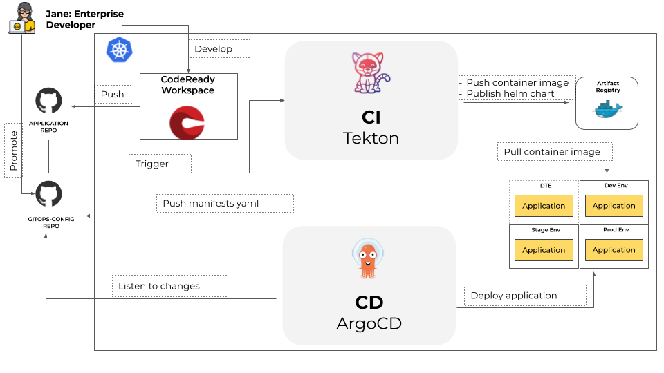

# How GitOps Works

GitOps is the delivery model at the heart of {{ product_name }}. The entire state of your platform — applications, environments, and cluster configuration — is declared in Git. ArgoCD watches those repositories and continuously reconciles the cluster to match what Git says it should be.

## Why Git as the source of truth

- **Full audit trail** — every change is a commit with an author, timestamp, and diff. No undocumented cluster edits.
- **Easy rollback** — reverting to a previous state is a Git revert, not a manual cluster operation.
- **Consistent environments** — all environments are configured from the same source. Drift is detected and corrected automatically.
- **Familiar workflow** — teams work in pull requests, code reviews, and branch strategies they already know.

## Core principles

- Git is the only source of truth for both infrastructure and application state.
- Application source code and deployment manifests live in separate repositories.
- Deployment manifests are standard Kubernetes YAML — nothing more than `kubectl apply` is needed to apply them manually.
- Helm is used to express the differences between environments (image tags, replica counts, resource limits).

## GitOps vs CI

CI (building and testing your code) is a separate concern from GitOps (deploying it). A typical flow looks like this:

1. A developer merges a pull request in the application repository.
1. CI builds a container image, tags it with a version, and pushes it to Harbor.
1. CI (or a human) opens a pull request in the apps GitOps repository updating the image tag.
1. Once that PR merges, ArgoCD detects the change and deploys the new version.

{{ product_name }} does not include a CI pipeline. Teams bring their own — GitHub Actions, GitLab CI, or anything that can push an image and open a PR.

---

Now that you understand the delivery model, the next page explains how the two GitOps repositories are structured before you set them up.

Continue to [GitOps repository structure](gitops-structure.md).
