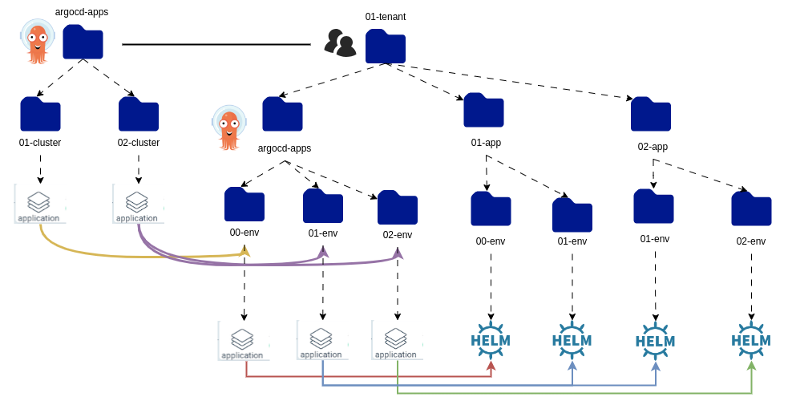

# GitOps Repository Structure

{{ product_name }} uses two separate Git repositories to manage your platform. Keeping them separate gives you a clean boundary between cluster-level infrastructure (who can deploy what, and where) and application workloads (what gets deployed). Understanding this structure is essential before you run the bootstrap steps.

---

## The two repositories

| Repository | What it contains |
|---|---|
| **infra-gitops-config** | Tenants, quotas, namespaces, and the ArgoCD applications that watch everything else. Cluster-scoped configuration. |
| **apps-gitops-config** | Application deployments, organized by tenant and environment. What your teams ship. |

ArgoCD watches both repositories and reconciles the cluster to match their contents automatically.

---

## Apps GitOps repository

The apps repository is organized around three levels: **tenant → application → environment**.

```
apps-gitops-config/
├── <tenant>/
│   ├── <application>/
│   │   ├── <env>/               # Helm chart or plain YAML for this environment
│   │   │   ├── Chart.yaml
│   │   │   └── values.yaml
│   │   └── <another-env>/
│   └── argocd-apps/
│       └── <env>/
│           └── <app>-<env>.yaml  # ArgoCD Application pointing to the folder above
└── argocd-apps/
    └── <cluster>/
        └── <tenant>-<env>.yaml   # Root-level ArgoCD Application for this cluster
```

**How it works:**

1. Each tenant has a folder. Inside it, each application has a folder.
2. Inside each application folder, each environment (dev, staging, prod) has its own folder with the deployment manifests.
3. `argocd-apps` inside the tenant folder contains ArgoCD Application resources that tell ArgoCD which folder to watch for each environment.
4. `argocd-apps` at the root contains cluster-level ArgoCD Applications — one per cluster — that point to the tenant-level `argocd-apps` above.

This is the [app-of-apps pattern](https://argo-cd.readthedocs.io/en/stable/operator-manual/cluster-bootstrapping/): ArgoCD manages other ArgoCD applications, giving you one entry point per cluster.



---

## Infra GitOps repository

The infra repository is organized by cluster. Each cluster folder contains the cluster-scoped resources and the ArgoCD applications that deploy them.

```
infra-gitops-config/
└── <cluster>/
    ├── argocd-apps/
    │   ├── tenant-operator-config.yaml   # deploys tenants and quotas
    │   └── apps-gitops-config.yaml       # points to the apps repo for this cluster
    └── tenant-operator-config/
        ├── tenants/
        │   └── <tenant>.yaml             # Tenant CR — who belongs to this tenant
        └── quotas/
            └── <quota>.yaml              # Quota CR — resource limits for this tenant
```

**How it works:**

1. Each cluster has its own folder.
2. The `argocd-apps` folder contains ArgoCD Application resources that watch the sibling folders — so ArgoCD deploys the tenants and quotas automatically.
3. One of those ArgoCD applications (`apps-gitops-config.yaml`) points to the apps repository, linking the two repos together.

---

## How the two repositories connect

The infra repository is the entry point. When ArgoCD syncs the infra repo, it deploys the tenant configuration and creates an ArgoCD application that watches the apps repo. From that point, the apps repo drives all application deployments.

```
infra-gitops-config  →  creates tenants and quotas
                     →  creates ArgoCD apps that watch apps-gitops-config
                                ↓
apps-gitops-config   →  deploys application workloads per tenant per environment
```

With this structure in mind, you are ready to configure both repositories.

Continue to [Configure the infra GitOps repository](../tutorials/configure-infra-gitops-repo.md).
