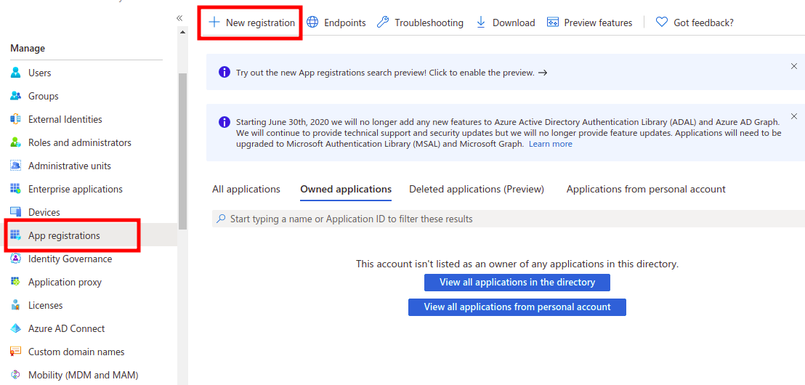
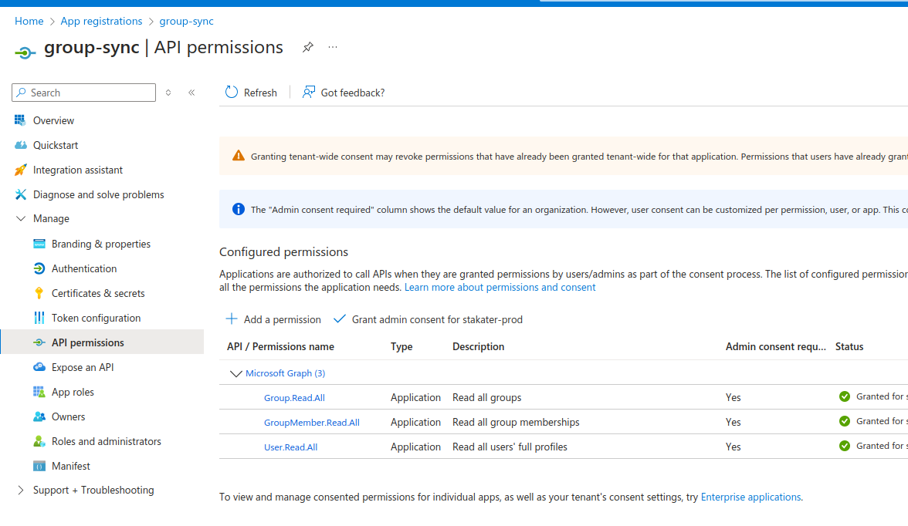
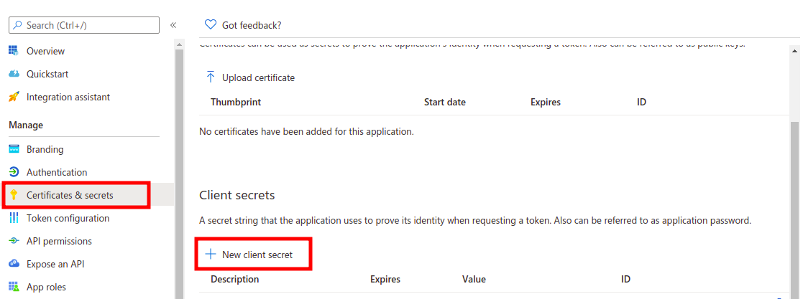
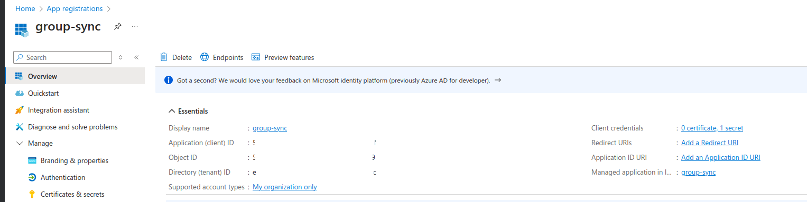

# Configure Azure AD group sync

This page explains how to register a second Azure AD application that allows {{ product_name }} to synchronize your Azure AD groups. Only users in synchronized groups are imported.

Complete [Connect Azure AD as an identity provider](azure-idp.md) before this step.

---

## 1. Register the group-sync application

1. Log in to the [Azure Portal](https://portal.azure.com).
2. Open the **Azure Active Directory** service.
3. Under **Manage**, click **App registrations**, then **New registration**.
4. Enter `group-sync` as the name and click **Register**.

---

## 2. Add API permissions

Go to **API permissions > Configured permissions** for the `group-sync` app and add:

- `Group.Read.All`
- `GroupMember.Read.All`
- `User.Read.All`

---

## 3. Create a client secret

1. Click **Certificates & secrets** in the left sidebar.
2. Click **New client secret**.
3. Enter `{{ product_name_lower }}-group-sync` as the description, choose an expiry, and click **Add**.
4. Copy the **Value** immediately — it will not be shown again.

---

## 4. Share the credentials with Stakater Support

From the `group-sync` app registration **Overview** tab, note the **Application (client) ID** and **Directory (tenant) ID**. Send these to Stakater Support via a secure channel along with the client secret:

- Application (client) ID
- Directory (tenant) ID
- Client secret

---

With group sync configured, continue to [Configure authorization roles](authorization-roles.md) to set up what authenticated users can do.
