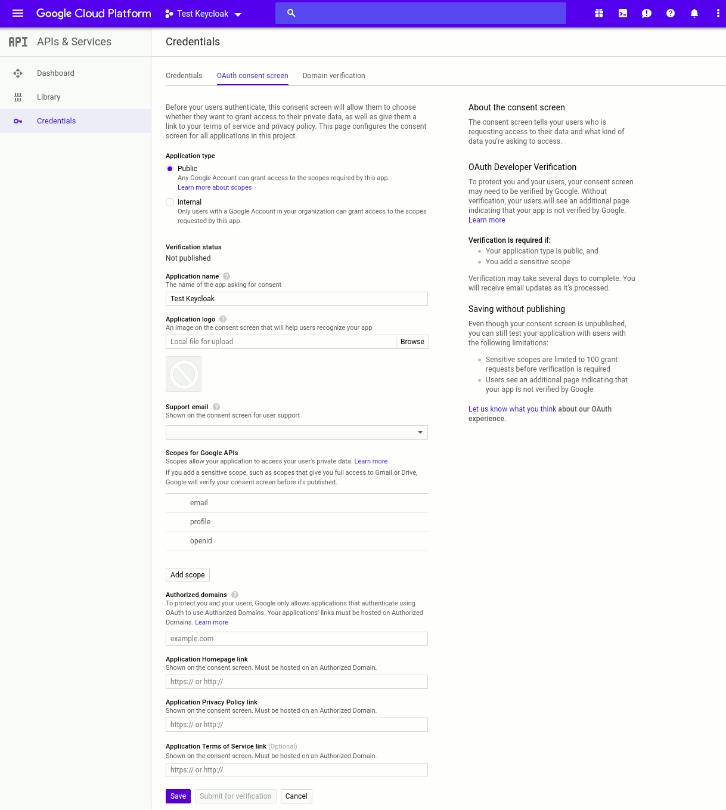
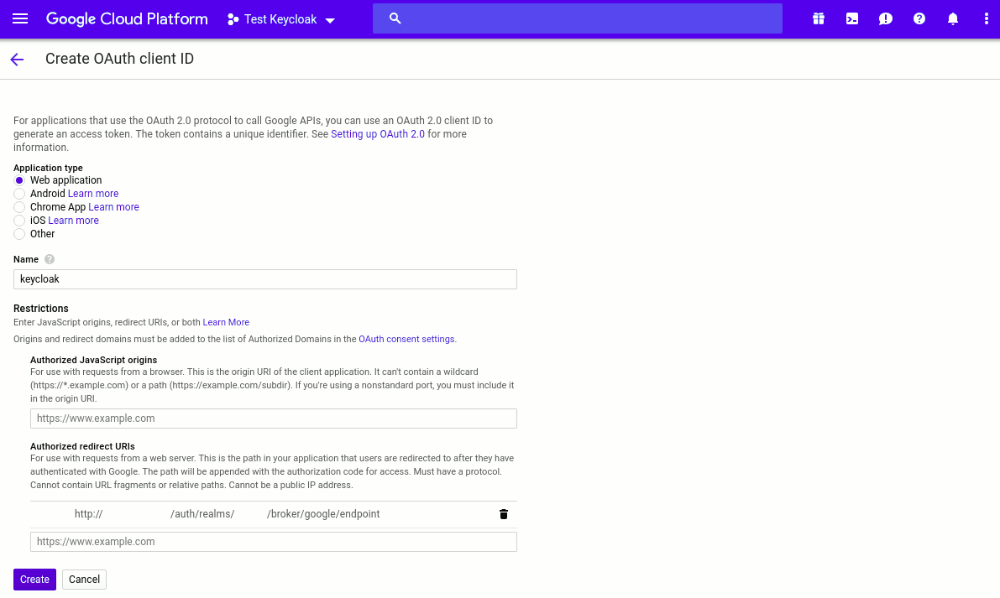
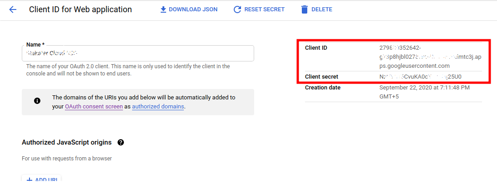

# Connect Google as an identity provider

This page explains how to register a Google OAuth application and share the credentials with Stakater Support so that users with a Google account can log into {{ product_name }}.

---

## 1. Create a project in the Google Developer Console

Log in to the [Google Developer Console](https://console.cloud.google.com/project) and click **Create Project**. Enter a name, then click **Create** and wait for the project to be ready.

---

## 2. Configure the OAuth consent screen

Google requires consent screen details before issuing any OAuth credentials. In your new project, navigate to **OAuth consent screen** and fill in the required fields:

- Set **Application type** to `Internal`.
- Add `email`, `profile`, and `openid` to the allowed **Scopes**.
- Under **Authorized domains**, add `kubeapp.cloud` and any hosted domains whose users you want to allow (for example, `xyz.com` allows `user@xyz.com`).

---

## 3. Create an OAuth client ID

Navigate to **APIs & Services > Credentials** and select **OAuth client ID** under **Create credentials**.

On the **Create OAuth client ID** page:

1. Set the application type to `Web application`.
1. Enter a name for the client.
1. Add the **Authorized redirect URIs** provided by Stakater Support.
1. Click **Create**.

---

## 4. Share the credentials with Stakater Support

After creating the client, click on your new **OAuth 2.0 Client ID** to view its settings. Send the following to Stakater Support via a secure channel:

- **Client ID**
- **Client Secret**
- **Authorized Domain** (the Google domain whose users you want to allow)

Stakater will complete the configuration and confirm when authentication is active.

---

With your identity provider connected, continue to [Configure authorization roles](authorization-roles.md) to set up what authenticated users can do.
