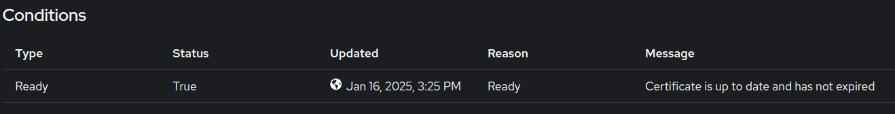

# Use http-01 certificate challenges

This page explains how to issue a TLS certificate for a specific hostname using cert-manager's http-01 challenge. Use this approach when you have a single hostname and a publicly reachable cluster.

For wildcard certificates or clusters without public http access, use [DNS-01 challenges](tls-certs.md) instead.

---

## 1. Create a DNS record

Create an entry in your DNS provider for the hostname you want to secure. Map the hostname to the cluster's ingress IP address using an `A` record or `CNAME`.

---

## 2. Deploy the Certificate and Route

Add both resources to your application's Helm chart at:

```text
<path-to-app-chart>/templates/
```

### Certificate

```yaml
apiVersion: cert-manager.io/v1
kind: Certificate
metadata:
  name: <certificate-name>
  namespace: <application-namespace>
spec:
  secretName: <tls-secret-name>
  issuerRef:
    name: <cluster-issuer-name>
    kind: ClusterIssuer
  commonName: <hostname>
  dnsNames:
    - <hostname>
```

Key fields:

- **`.spec.secretName`** — The secret cert-manager creates once the certificate is issued.
- **`.spec.dnsNames`** — The hostname to secure. Must match the DNS record you created in step 1.
- **`.spec.issuerRef.name`** — The `ClusterIssuer` name. Confirm with your cluster administrator.

!!! note
    Avoid deleting or modifying existing certificates. Doing so can trigger [Let's Encrypt rate limits](https://letsencrypt.org/docs/rate-limits/).

### Route

```yaml
apiVersion: route.openshift.io/v1
kind: Route
metadata:
  name: <route-name>
  namespace: <application-namespace>
  annotations:
    cert-utils-operator.redhat-cop.io/certs-from-secret: <tls-secret-name>
    cert-utils-operator.redhat-cop.io/inject-CA: "false"
spec:
  host: <hostname>
  path: /
  port:
    targetPort: http
  to:
    kind: Service
    name: <service-name>
    weight: 100
  wildcardPolicy: None
  tls:
    termination: edge
    insecureEdgeTerminationPolicy: Redirect
```

The `cert-utils-operator` annotation injects the certificate from the secret into the route automatically once cert-manager issues it.

---

## 3. Validate

### Certificate

1. In the cluster console, switch to **Administrator** view and navigate to **Home > Search**.
1. Select the application namespace and search for `Certificate`.
1. Inspect the certificate and confirm the **Condition** shows it is up-to-date.

    

### Route

1. Navigate to **Networking > Routes** in the cluster console.
1. Locate the route for your application.
1. Confirm the route is listed, its status is **Accepted**, and the hostname and TLS configuration are correct.
