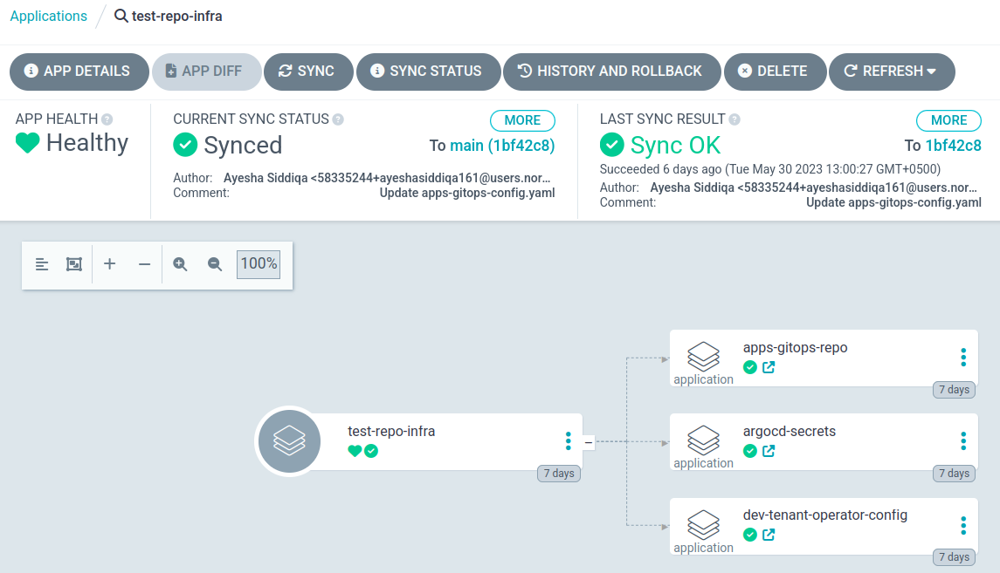

# Configure the Apps GitOps Repository

By the end of this tutorial, your `apps-gitops-config` repository will be structured, linked to the infra repository, and ArgoCD will be watching it. Application deployments for your first tenant will be driven from Git.

This is the second bootstrap step. If you haven't yet completed [Configure the infra GitOps repository](configure-infra-gitops-repo.md), do that first.

**Prerequisites:**

- The infra GitOps repository is set up and ArgoCD has synced it.
- The `git-pat-creds` secret is already in OpenBao from the previous tutorial. If your apps repository is in the same Git organization, the same PAT applies. If it is in a different organization, add a new PAT to `git-pat-creds` with the same permissions before continuing.

A [template repository](https://github.com/stakater-lab/apps-gitops-config.git) is available to use as a starting point.

Throughout this tutorial, replace the following placeholders with your own values:

| Placeholder | Description |
|---|---|
| `TENANT_NAME` | The tenant name you defined in the infra repository |
| `APP_NAME` | The name of your application |
| `CLUSTER_NAME` | Your cluster folder name (e.g. `dev-cluster`) |
| `APPS_GITOPS_REPO_URL` | The URL of this apps GitOps repository |
| `INFRA_GITOPS_REPO_URL` | The URL of your infra GitOps repository |

---

## 1. Create the repository

Create an empty repository in your SCM named `apps-gitops-config`.

---

## 2. Build the folder structure

The apps repository is organized as: **tenant → application → environment**. Each level is a folder.

Create a folder at the root named after your tenant (`TENANT_NAME`). Inside the tenant folder, create an `argocd-apps` folder — this is where ArgoCD Application resources for this tenant will live.

Create an application folder inside the tenant folder (`APP_NAME`). Inside the application folder, create a folder for each environment (`dev`, `staging`, etc.). These folders will hold the Helm chart or plain YAML for each environment.

Your structure should now look like this:

```text
apps-gitops-config/
└── TENANT_NAME/
    ├── argocd-apps/
    │   ├── dev/
    │   └── staging/
    └── APP_NAME/
        ├── dev/
        └── staging/
```

---

## 3. Create ArgoCD applications for each environment

For each environment, create an ArgoCD Application resource in the matching `argocd-apps/<env>/` folder. The application points to the deployment manifests in the sibling application folder.

Create `TENANT_NAME/argocd-apps/dev/APP_NAME.yaml`:

```yaml
apiVersion: argoproj.io/v1alpha1
kind: Application
metadata:
  name: TENANT_NAME-dev-APP_NAME
  namespace: rh-openshift-gitops-instance
spec:
  destination:
    namespace: TENANT_NAME-dev
    server: 'https://kubernetes.default.svc'
  project: TENANT_NAME
  source:
    path: TENANT_NAME/APP_NAME/dev
    repoURL: 'APPS_GITOPS_REPO_URL'
    targetRevision: HEAD
  syncPolicy:
    automated:
      prune: true
      selfHeal: true
```

Create a matching file for each additional environment (e.g. `TENANT_NAME/argocd-apps/staging/APP_NAME.yaml`).

---

## 4. Create the root ArgoCD applications

The root-level `argocd-apps` folder is the entry point per cluster. It contains one ArgoCD Application per tenant-environment combination, pointing to the tenant-level `argocd-apps` above.

Create an `argocd-apps/CLUSTER_NAME/` folder for each cluster you are deploying to.

Create `argocd-apps/CLUSTER_NAME/TENANT_NAME-dev.yaml` pointing to the tenant-level `argocd-apps` for the dev environment:

```yaml
apiVersion: argoproj.io/v1alpha1
kind: Application
metadata:
  name: TENANT_NAME-dev
  namespace: rh-openshift-gitops-instance
spec:
  destination:
    namespace: rh-openshift-gitops-instance
    server: 'https://kubernetes.default.svc'
  project: TENANT_NAME
  source:
    path: TENANT_NAME/argocd-apps/dev
    repoURL: 'APPS_GITOPS_REPO_URL'
    targetRevision: HEAD
  syncPolicy:
    automated:
      prune: true
      selfHeal: true
```

---

## 5. Link the apps repository to the infra repository

This step closes the loop — ArgoCD, bootstrapped from the infra repo, will start watching the apps repo. Make the following changes in your **infra** repository, inside the cluster folder (e.g. `CLUSTER_NAME/`).

Create a `gitops-repositories/` folder and add an `ExternalSecret` that gives ArgoCD read access to the apps repository:

```yaml
apiVersion: external-secrets.io/v1beta1
kind: ExternalSecret
metadata:
  name: apps-gitops-creds
  namespace: rh-openshift-gitops-instance
spec:
  refreshInterval: 1m0s
  secretStoreRef:
    name: tenant-vault-shared-secret-store
    kind: SecretStore
  data:
  - remoteRef:
      key: git-pat-creds
      property: username
    secretKey: username
  - remoteRef:
      key: git-pat-creds
      property: password
    secretKey: password
  target:
    name: apps-gitops-creds
    template:
      metadata:
        labels:
          argocd.argoproj.io/secret-type: repository
      data:
        name: apps-gitops-creds
        password: "{{ .password | toString }}"
        username: "{{ .username | toString }}"
        project: TENANT_NAME
        type: git
        url: 'APPS_GITOPS_REPO_URL'
```

Add an ArgoCD Application in `CLUSTER_NAME/argocd-apps/gitops-repositories.yaml` that deploys the secret above:

```yaml
apiVersion: argoproj.io/v1alpha1
kind: Application
metadata:
  name: gitops-repositories
  namespace: rh-openshift-gitops-instance
spec:
  destination:
    server: 'https://kubernetes.default.svc'
  source:
    path: CLUSTER_NAME/gitops-repositories
    repoURL: 'INFRA_GITOPS_REPO_URL'
    targetRevision: HEAD
    directory:
      recurse: true
  project: root-tenant
  syncPolicy:
    automated:
      prune: true
      selfHeal: true
```

Add an ArgoCD Application in `CLUSTER_NAME/argocd-apps/apps-gitops-config.yaml` that watches the root `argocd-apps` in the apps repository:

```yaml
apiVersion: argoproj.io/v1alpha1
kind: Application
metadata:
  name: apps-gitops-config
  namespace: rh-openshift-gitops-instance
spec:
  destination:
    namespace: rh-openshift-gitops-instance
    server: 'https://kubernetes.default.svc'
  project: root-tenant
  source:
    path: argocd-apps/CLUSTER_NAME
    repoURL: 'APPS_GITOPS_REPO_URL'
    targetRevision: HEAD
  syncPolicy:
    automated:
      prune: true
      selfHeal: true
```

---

## 6. Verify

Log in to ArgoCD and open the `infra-gitops-config` application. Verify that `gitops-repositories` and `apps-gitops-config` have appeared as child applications and synced successfully.

The image below shows a fully linked infra-apps structure in ArgoCD:



---

Both repositories are now set up and ArgoCD is managing your full GitOps structure. Any commit to the apps repository will be picked up and applied to the cluster automatically.

Continue to [Connect your identity provider](../how-to-guides/keycloak-idp.md).
